# Market Basket Analysis on Grocery Transactions

Market basket analysis is a technique I use to discover which products customers tend to buy together. The concept is intuitive — if someone puts bread in their cart, they are probably also buying butter — but doing it rigorously across thousands of transactions reveals patterns that intuition alone would miss. In this project, I analyzed 38,765 item-level records from a grocery store spanning two years and nearly 15,000 transactions to uncover co-purchase patterns using two complementary approaches. First, I applied association rule mining with the FP-Growth algorithm, which produces directional rules like "customers who buy frankfurters also tend to buy other vegetables" with precise measures of how strong each relationship is. Second, I built a co-occurrence network where items are nodes and edges represent how often they appear together, then used community detection to identify natural product clusters and centrality metrics to identify "hub" items that connect different parts of the store. Together, these two methods give a complete picture — association rules tell me which specific products to recommend at checkout, while the network reveals how the entire product catalog is structured and which items sit at the center of purchasing behavior.

---

## Dataset Overview

The data comes from the Groceries Dataset on Kaggle, containing item-level purchase records from a grocery retailer between January 2014 and December 2015.

| Property | Value |
|----------|-------|
| Total Item Records | 38,765 |
| Unique Members | 3,898 |
| Unique Items | 167 |
| Total Transactions | 14,963 |
| Average Items per Transaction | 2.59 |
| Date Range | Jan 2014 - Dec 2015 |

Each row in the raw data represents a single item purchased by a specific member on a specific date. I defined a "transaction" as all items purchased by the same member on the same day, which gave me 14,963 baskets to analyze.

---

## Exploratory Data Analysis

### Item Frequency

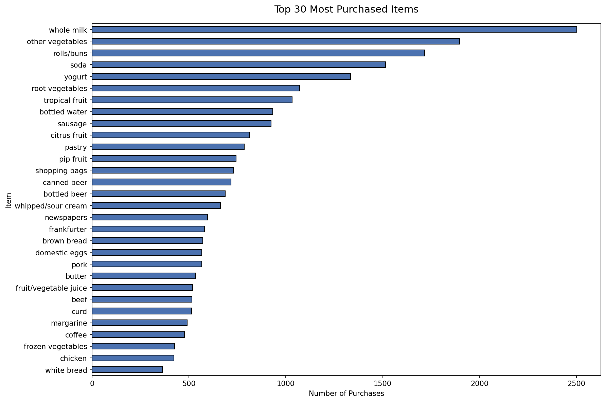

This chart shows the 30 most purchased items in the dataset. Whole milk is the most popular item by a wide margin at 2,502 purchases, followed by other vegetables (1,898), rolls/buns (1,716), and soda (1,514). The steep drop-off from the top items to the rest is typical of grocery data — a relatively small number of staple products account for a disproportionate share of all purchases. This pattern is important for the analysis because these high-frequency items will naturally appear in more rules and have more network connections, so I need to focus on metrics like lift (rather than raw frequency) to find genuinely interesting relationships.

### Basket Size Distribution

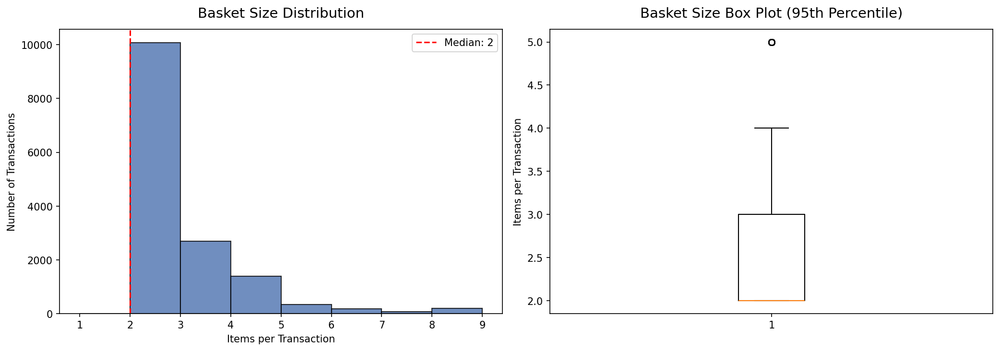

These two charts show how many items customers typically buy per trip. The histogram (left) reveals that the most common basket size is 1-2 items, with a median of 2 items per transaction. The box plot (right) confirms that baskets are generally small, with most trips involving 1 to 4 items. I removed single-item transactions (205 of them) during preprocessing because they cannot contribute to co-purchase analysis — there is nothing to pair them with.

### Transaction Volume Over Time

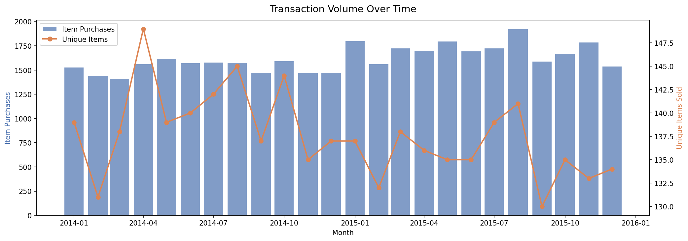

This dual-axis chart shows monthly item purchases (bars) alongside the count of unique items sold each month (line). Transaction volume is relatively stable throughout the two-year period, with no obvious seasonal spikes or dips. The consistent variety of items sold each month (hovering around 140-150 of 167 total items) indicates a broad product mix being purchased throughout the year.

### Item Frequency Distribution

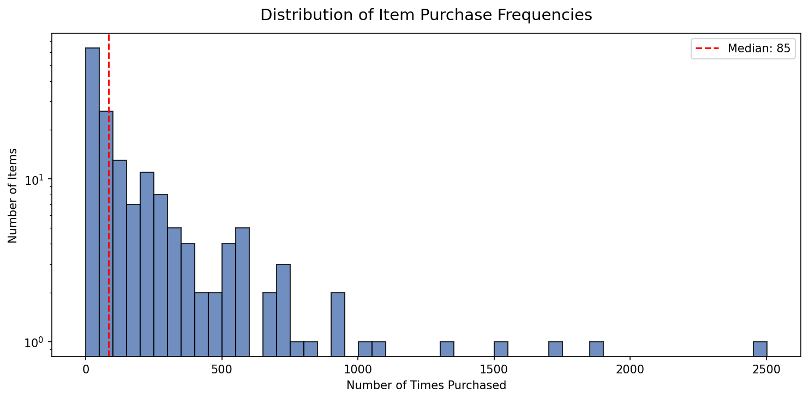

This histogram shows how purchase frequencies are distributed across all 167 items (plotted on a log scale). Most items are purchased relatively infrequently — the median item appears just 130 times across the entire dataset. A small handful of staple items (whole milk, vegetables, rolls) are purchased thousands of times, while most specialty items are purchased fewer than 200 times. This "long tail" distribution is why I used a relatively low minimum support threshold (0.5%) — setting it too high would exclude all but the most common items.

### Member Activity

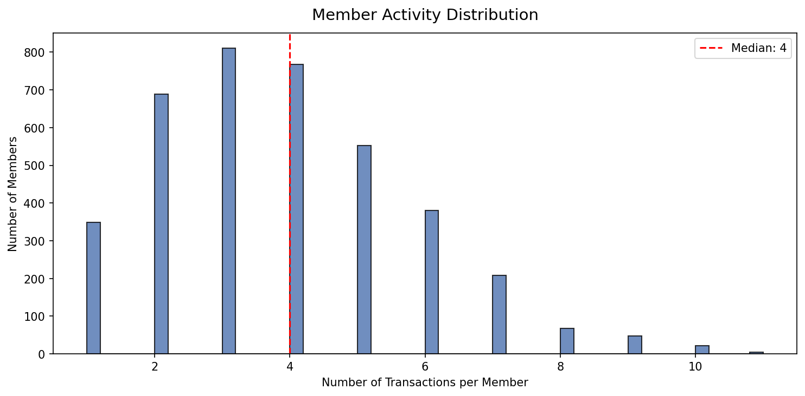

This chart shows how many trips each member made to the store. The median member made 3 visits over the two-year period. The distribution is right-skewed — most members visit infrequently, while a smaller group of regulars visited 10 or more times. Understanding member activity helps contextualize the basket data: since most members have relatively few transactions, the co-purchase patterns I discover are not driven by a handful of power shoppers but reflect broad purchasing behavior across the entire customer base.

### Day of Week

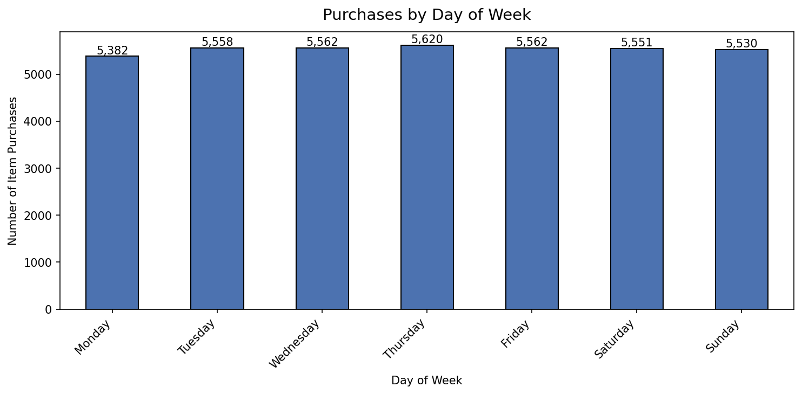

This chart breaks down purchasing volume by day of the week. Shopping is relatively evenly distributed, though there is a modest mid-week peak on Wednesday and Thursday. This pattern suggests this particular retailer does not experience the strong weekend shopping surges seen in some markets, which means my co-purchase patterns likely apply consistently throughout the week rather than being driven by a specific shopping occasion like a weekly stock-up trip.

---

## Preprocessing

I transformed the raw item-level data into a format suitable for both association rule mining and network analysis.

### Transaction Construction

Starting from 14,963 transactions, I grouped items by member and date to form baskets, deduplicated items within each basket (since I care about what was bought together, not quantities), and removed 205 single-item transactions since they cannot reveal co-purchase relationships. This left 14,758 multi-item transactions for analysis.

| Step | Count |
|------|-------|
| Total Transactions | 14,963 |
| Single-Item Removed | 205 |
| Multi-Item Retained | 14,758 |
| Unique Items | 167 |

### Basket Matrix

I one-hot encoded the transactions into a binary matrix where each row is a transaction and each column is an item (1 = purchased, 0 = not). This 14,758 x 167 matrix is extremely sparse at 98.47% — meaning the average transaction contains only about 1.5% of all available items. This sparsity is normal for grocery data and is precisely why specialized algorithms like FP-Growth exist.

### Item Support Distribution

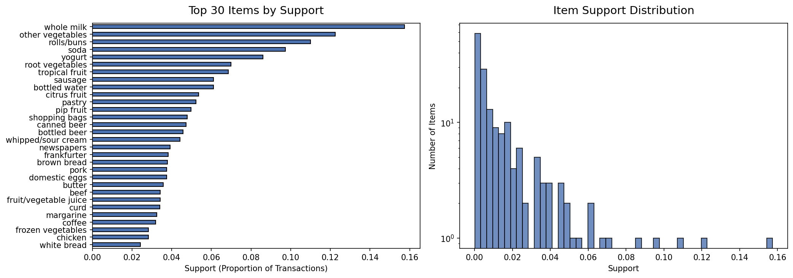

The left panel shows the top 30 items ranked by their support — the proportion of transactions containing that item. Whole milk leads at 15.7%, meaning roughly 1 in 6 transactions includes milk. The right panel shows that support follows a steeply declining distribution, with most items appearing in fewer than 1% of transactions. I set the minimum support threshold at 0.5% to capture meaningful patterns while filtering out noise from extremely rare items.

---

## Association Rules (FP-Growth)

Association rule mining discovers directional relationships between items. The FP-Growth algorithm builds a compressed tree structure from the transaction data to efficiently find all sets of items that appear together at least as often as the minimum support threshold, then derives rules like "{A} → {B}" with measures of how strong each relationship is.

### Key Metrics

| Metric | What It Means |
|--------|---------------|
| **Support** | Proportion of all transactions containing both items. Higher support means the pattern is more common. |
| **Confidence** | Of all transactions containing the left-hand item, what proportion also contain the right-hand item? Essentially P(B given A). |
| **Lift** | How much more likely are the items to be purchased together than if they were independent? A lift of 1.11 means the pair is 11% more likely than chance. |

### Support vs. Confidence

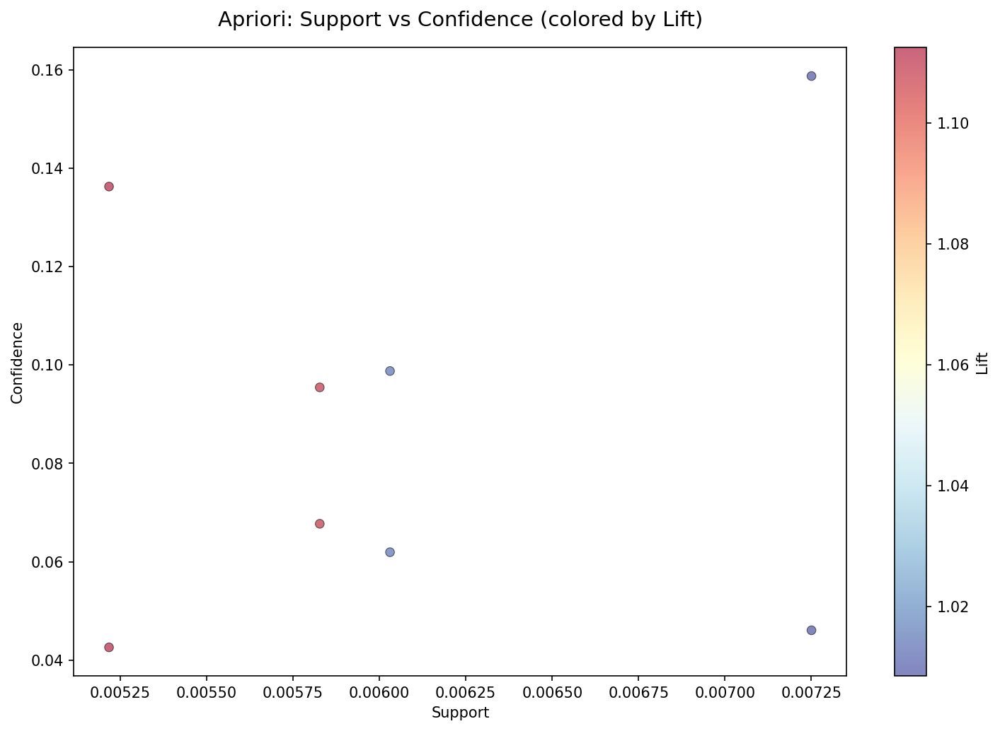

This scatter plot shows every discovered rule positioned by its support (x-axis) and confidence (y-axis), with color representing lift. All eight rules cluster in a narrow support range (0.5-0.7%), which makes sense given the sparse nature of the data. The color gradient shows that the highest-lift rules (warmest colors) tend to have moderate confidence — the most interesting patterns are not necessarily the most common ones.

### Top Rules by Lift

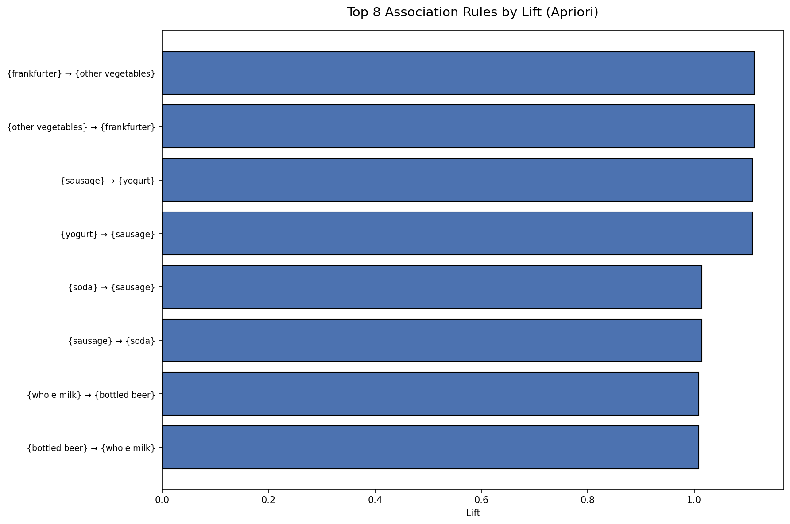

This chart ranks all eight association rules by lift. The strongest rule is {frankfurter} → {other vegetables} with a lift of 1.11, meaning customers who buy frankfurters are 11% more likely to also buy vegetables than the average customer. The {sausage} → {yogurt} rule has a similar lift of 1.11. These make intuitive sense — frankfurters and sausages are meal components that pair naturally with side dishes and breakfast items. The {whole milk} → {bottled beer} rule, while having the highest support, has the weakest lift (1.01), reflecting the fact that both items are simply very popular rather than having a strong specific association.

### Metric Distributions

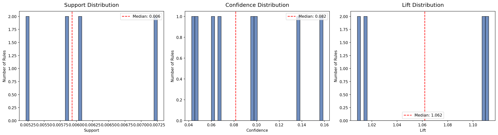

These histograms show the distribution of support, confidence, and lift across all eight rules. Support is tightly clustered around 0.5-0.7%, confidence ranges from about 4% to 16%, and lift values are modest (1.01 to 1.11). The lift values being close to 1.0 is expected for grocery data — with 167 items and relatively small baskets, even genuinely associated items do not produce dramatic lift values.

### Association Rules Summary

| Metric | Mean | Median | Max |
|--------|------|--------|-----|
| Support | 0.0061 | 0.0059 | 0.0073 |
| Confidence | 0.0884 | 0.0816 | 0.1588 |
| Lift | 1.0612 | 1.0618 | 1.1124 |

---

## Network Analysis

While association rules focus on directional predictions ("if A then B"), network analysis treats the product catalog as a graph and asks structural questions: which items sit at the center of purchasing behavior? Which items naturally cluster together? Which items bridge different product categories?

### Co-occurrence Graph

I built a graph where each item is a node and an edge connects two items whenever they appear in the same basket at least 5 times. This threshold filters out incidental pairings while preserving genuine co-purchase relationships.

| Property | Value |
|----------|-------|
| Nodes (Items) | 126 |
| Edges (Item Pairs) | 1,885 |
| Graph Density | 0.2394 |
| Average Shortest Path | 1.78 |
| Average Clustering Coefficient | 0.0558 |

The graph includes 126 of the 167 items (the remaining 41 never co-occurred with any other item at least 5 times). With a density of 0.24, about a quarter of all possible item pairs have meaningful co-occurrence — the grocery catalog is moderately interconnected.

### Network Visualization

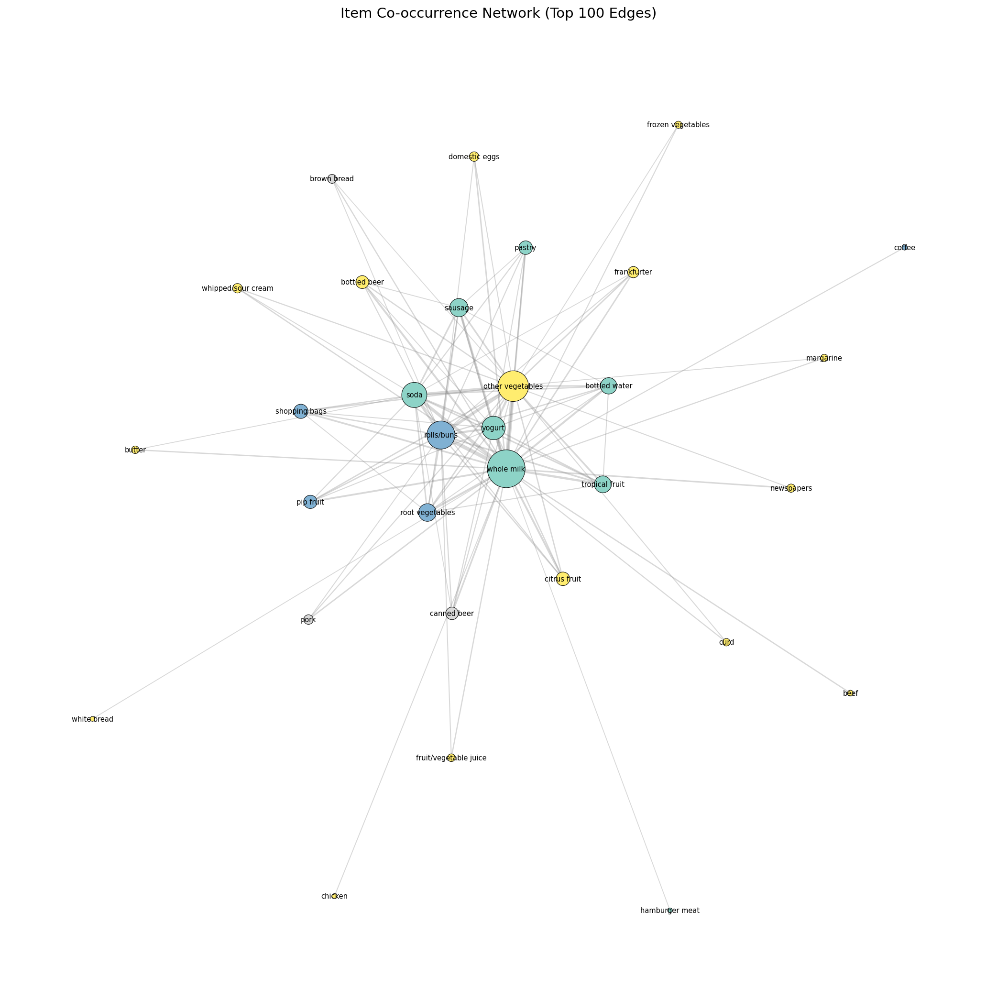

This visualization shows the top 100 strongest edges in the co-occurrence network. Node size reflects weighted degree (how often the item co-occurs with others), and node color indicates community membership (detected via the Louvain algorithm). The most central items — whole milk, other vegetables, rolls/buns — sit at the heart of the graph, connected to nearly everything else. The spatial layout reveals that items naturally cluster into groups, with hub items bridging the communities.

### Centrality Rankings

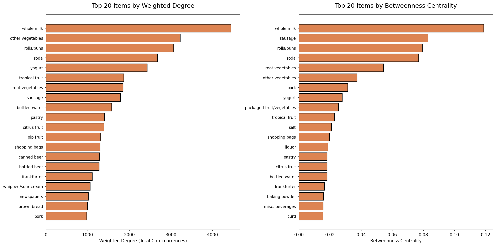

These two charts identify the most important items in the network using complementary measures. **Weighted degree** (left) counts how many times an item co-occurs with any other item — whole milk leads at 4,438, meaning it appeared alongside other items a total of 4,438 times. **Betweenness centrality** (right) identifies items that bridge different parts of the network — whole milk again leads, but sausage and soda rank surprisingly high, suggesting they connect different product communities. An item with high betweenness but moderate weighted degree is a "bridge" item — it does not dominate sales, but it links different shopping patterns together.

| Rank | Item | Weighted Degree | Betweenness Centrality |
|------|------|-----------------|----------------------|
| 1 | whole milk | 4,438 | 0.1188 |
| 2 | other vegetables | 3,225 | 0.0374 |
| 3 | rolls/buns | 3,066 | 0.0794 |
| 4 | soda | 2,677 | 0.0770 |
| 5 | yogurt | 2,430 | 0.0279 |

### Community Detection

I used the Louvain algorithm to automatically detect communities — groups of items that co-occur more frequently with each other than with items outside the group.

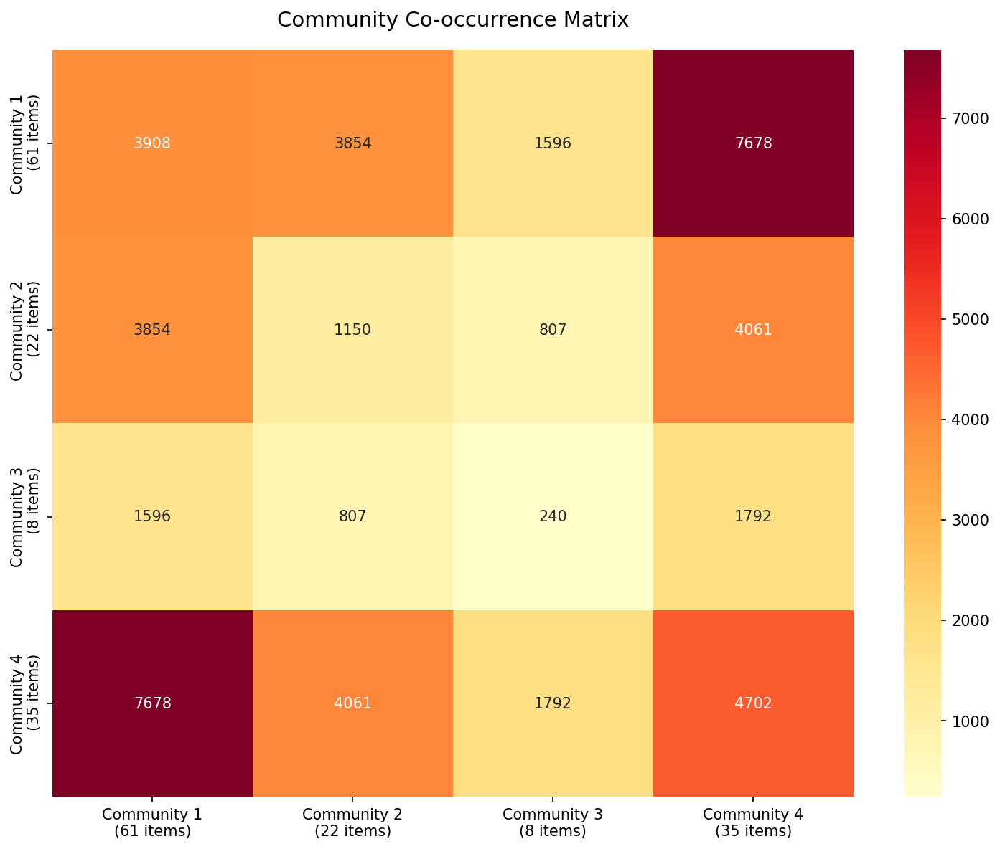

This heatmap shows how strongly each community is connected to every other community. The diagonal values (intra-community connections) are higher than off-diagonal values, confirming that the communities represent real clustering in the data. Four natural product communities emerged:

| Community | Items | Top Products | Interpretation |
|-----------|-------|--------------|----------------|
| 1 | 61 | whole milk, soda, yogurt, tropical fruit, sausage | Daily staples & beverages |
| 2 | 22 | rolls/buns, root vegetables, pip fruit, shopping bags, coffee | Bakery & produce |
| 3 | 8 | canned beer, brown bread, pork, onions, oil | Cooking ingredients |
| 4 | 35 | other vegetables, citrus fruit, bottled beer, frankfurter, whipped cream | Fresh & specialty items |

These communities could inform store layout — items within the same community are frequently purchased together and could be placed in proximity to encourage additional purchases.

### Edge Weight Distribution

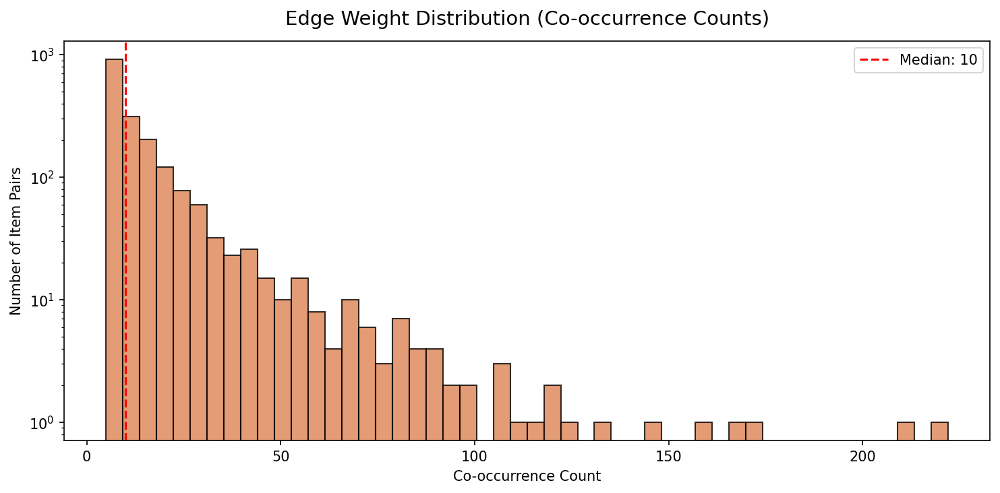

This histogram (log scale) shows the distribution of co-occurrence counts across all 1,885 item pairs. Most pairs co-occur only 5-10 times, while a few staple pairs co-occur over 100 times. The five strongest edges are all pairings with whole milk — confirming its role as the universal "hub" item in the grocery network.

| Rank | Item Pair | Co-occurrences |
|------|-----------|---------------|
| 1 | other vegetables — whole milk | 222 |
| 2 | rolls/buns — whole milk | 209 |
| 3 | soda — whole milk | 174 |
| 4 | whole milk — yogurt | 167 |
| 5 | other vegetables — rolls/buns | 158 |

---

## Comparison of Approaches

### Top Items: Association Rules vs. Network

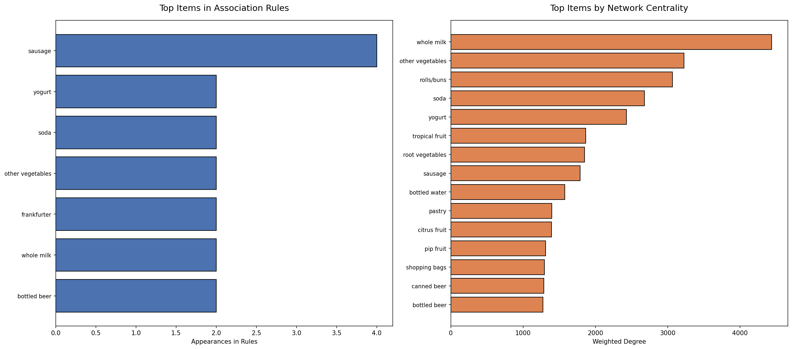

This side-by-side comparison reveals how the two methods surface different perspectives on the same data. Association rules (left) identified just 7 unique items across 8 rules — the method is selective, focusing only on pairs with statistically elevated co-purchase rates. The network (right) ranks all 126 connected items by weighted degree, providing a comprehensive view of which items are most central to overall purchasing. Items like sausage and frankfurter appear prominently in association rules (they have strong specific pairings) but rank lower in the network (they are not broadly connected). Conversely, whole milk dominates the network but produces low-lift rules because it is so universally purchased.

### Rule Strength vs. Network Edge Weight

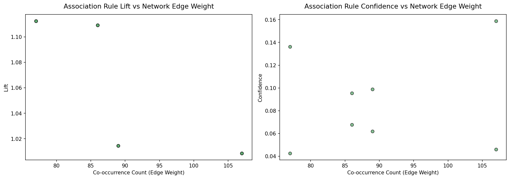

These scatter plots explore whether items with strong association rules also have strong network connections. The left panel plots lift against edge weight and the right panel plots confidence against edge weight. An interesting pattern emerges: the highest-lift rules do not correspond to the heaviest edges. This is because lift measures how much more likely a pair is than chance, which penalizes common items. The network simply counts raw co-occurrences, which favors common items. This divergence is exactly why both methods add value — they measure fundamentally different things.

### Methodology Comparison

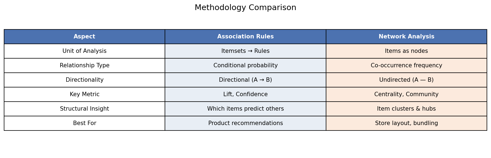

| Aspect | Association Rules | Network Analysis |
|--------|------------------|-----------------|
| **Unit of Analysis** | Itemsets → Rules | Items as nodes |
| **Relationship Type** | Conditional probability | Co-occurrence frequency |
| **Directionality** | Directional (A → B) | Undirected (A — B) |
| **Key Metric** | Lift, Confidence | Centrality, Community |
| **Structural Insight** | Which items predict others | Item clusters & hubs |
| **Best For** | Product recommendations | Store layout, bundling |

Association rules answer the question "given that a customer bought item A, how much more likely are they to buy item B?" — making them ideal for recommendation engines and targeted cross-selling at the point of sale. Network analysis answers the question "how is the entire product catalog organized in terms of co-purchasing behavior?" — making it ideal for store layout optimization, category management, and identifying which items should be bundled in promotions. I found that using both methods together provides a richer picture than either method alone: association rules give me the specific product recommendations, while the network tells me the structural story of how the catalog hangs together.

---

## Key Design Decisions

| Decision | Rationale |
|----------|-----------|
| Groceries dataset | I chose a real-world grocery transaction dataset because market basket analysis originated in retail and the patterns are intuitive to explain. The 167-item catalog is large enough to produce meaningful patterns but small enough to visualize clearly. |
| FP-Growth over Apriori | Both algorithms produce identical results, but FP-Growth builds a compressed tree structure that avoids expensive candidate generation, making it significantly faster. Since the results are mathematically equivalent, I chose the more efficient algorithm. |
| Min support of 0.5% | With 14,758 transactions and 167 items, a 1% threshold was too aggressive (only 5 item pairs survived), while lower thresholds generated noise. At 0.5%, I found 130 frequent itemsets and 8 meaningful rules — a reasonable balance for this dataset. |
| Network co-occurrence threshold of 5 | Requiring at least 5 co-occurrences filters out incidental pairings (items that happened to land in the same basket once or twice by chance) while preserving genuine relationships. This kept 126 of 167 items in the graph. |
| Louvain community detection | Louvain is efficient, parameter-free (no need to specify the number of communities upfront), and naturally handles weighted graphs. The four communities it found align well with intuitive product categories. |
| Two complementary methods | Association rules and network analysis answer different questions. Rules are directional and precise but narrow (only 8 rules with 7 items). Networks are comprehensive (126 items, 1,885 relationships) but undirected. Combining them provides both specific recommendations and structural understanding. |
